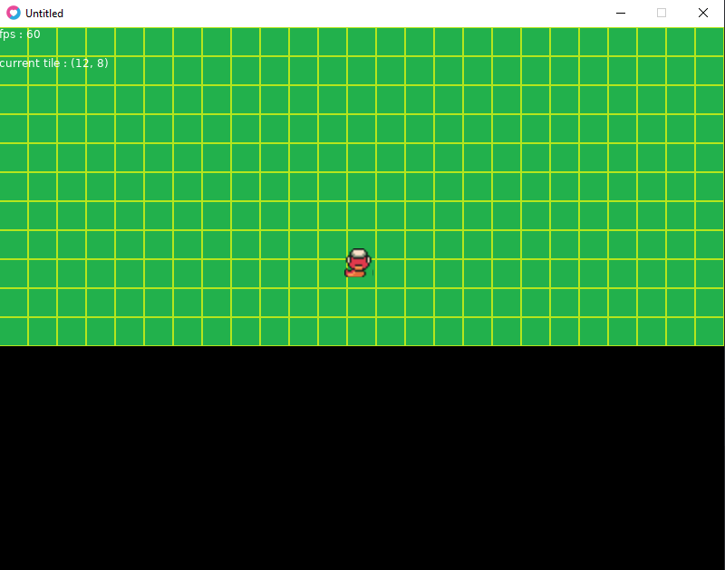

# starter pack  lua love2D

## wip

<ul>
    <li>refactoring and bugfix</li>
</ul>

## todo

<ul>
    <li>scene (menu, jeu ... etc)</li>
    <li>collisions</li>
    <li>gestion massive d'element sur la map</li>
    <li>arbre et algo de pathfinding</li>
    <li>... etc</li>
</ul>

## done

<ul>
    <li>service de sons</li>
    <li>affiche d'une grande map disponible</li>
    <li>camera</li>
    <li>animations avec des quads</li>
    <li>architecture projet stable, séparation bas/haut niveau (app/core)</li>
    <li>sprite de départ</li>
    <li>config.lua OK</li>
    <li>run.bat pour run le projet</li>
    <li>...</li>
</ul>