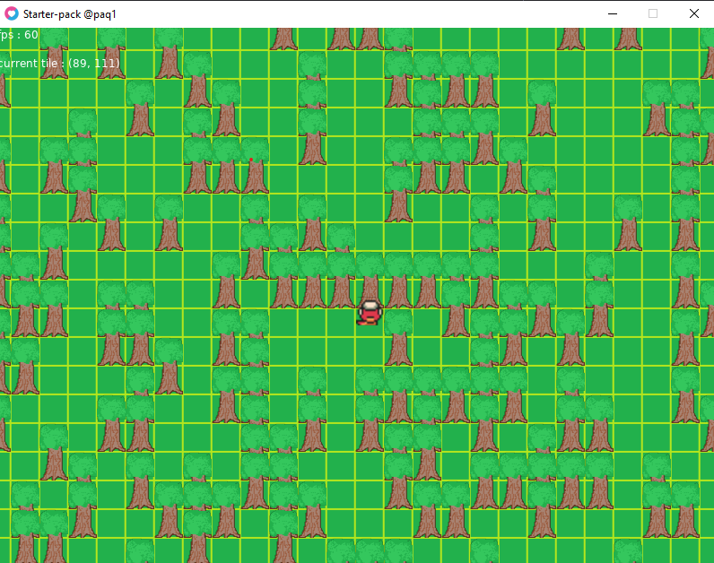
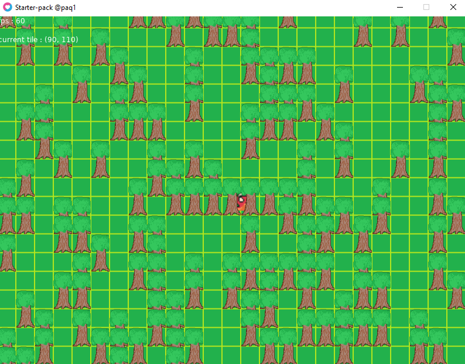

# starter pack  lua love2D

seed pour les screen shoot : 1234

 

## prise en charge par le starter pack

<ul>
    <li>gestion de la souris</li>
    <li>destruction basique d'element sur la map</li>
    <li>service de sons</li>
    <li>gestion massive d'element sur la map</li>
    <li>affiche d'une grande map disponible</li>
    <li>camera</li>
    <li>animations avec des quads</li>
    <li>architecture projet stable, séparation bas/haut niveau (app/core)</li>
    <li>sprite de départ</li>
    <li>config.lua OK</li>
    <li>run.bat pour run le projet</li>
    <li>...</li>
</ul>

## deployement

<ul>
    <li><a href="https://love2d.org/wiki/Game_Distribution">link</a></li>
</ul>